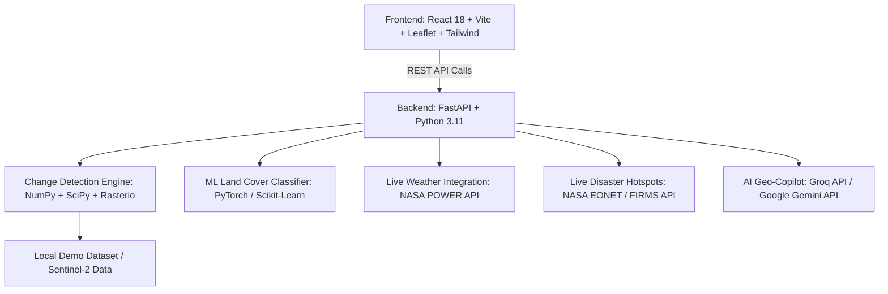

# 🌍 TerraTrace AI — AI-Powered Geospatial Land Cover & Disaster Analytics Platform
> **Smart India Hackathon (SIH 2026) — Problem Statement PS227**

TerraTrace AI is an enterprise-grade AI/ML geospatial analytics system designed for bi-temporal satellite image change detection, land cover transition monitoring, climate correlation, and interactive AI Geo-Copilot query parsing.

---

## 📸 Key Capabilities

1. **Bi-Temporal Change Detection**:
   - Compares Pre-event ($T_1$) and Post-event ($T_2$) multi-spectral satellite imagery.
   - Computes multi-band spectral indices:
     - **NDVI** (Normalized Difference Vegetation Index) — Vegetation health & deforestation.
     - **NDWI** (Normalized Difference Water Index) — Flood mapping & surface water dynamics.
     - **NDBI** (Normalized Difference Built-up Index) — Urban expansion & infrastructure loss.
   - SCL (Scene Classification Layer) quality filtering for cloud, shadow, and unusable pixel masking.

2. **Multi-Class Land Cover Classification**:
   - Classifies land dynamics into:
     - 🌲 **Forest Loss / Deforestation**
     - 🏗️ **Urban Expansion / Built-up Growth**
     - 🌊 **Flood / Water Body Expansion**
     - 🚜 **Agricultural / Bare Land Transition**

3. **Live External API Data Integration**:
   - **NASA POWER API**: Fetches live & historical meteorological indicators (Surface Temperature `T2M`, Relative Humidity `RH2M`, Precipitation `PRECTOTCORR`, Solar Radiation `ALLSKY_SFC_SW_DW`).
   - **NASA EONET / FIRMS API**: Fetches real-time active natural disaster events & wildfire hotspots with geo-coordinates.
   - **Copernicus Data Space & NASA GIBS**: Live satellite basemap overlay integration.

4. **AI Geo-Copilot & RAG Assistant**:
   - Powered by **Groq (`groq/compound-mini`)** & **Google Gemini API**.
   - Natural language query understanding & ROI intent parsing (e.g. *"Show deforestation in Mumbai over the last 12 months"*).
   - Voice input integration via Browser Web Speech API.

5. **Linear Regression Predictive Engine & PDF Reporting**:
   - 12–24 month linear trend projection for vegetation loss & urban sprawl.
   - Automated executive PDF report generator featuring metric cards, spectral distribution, climate correlation, and risk assessment scores.

---

## 🏗️ System Architecture



---

## 📂 Project Structure

```text
SIH_WITH_changes/
├── backend/
│   ├── app/
│   │   ├── api/v1/
│   │   │   └── change_detection.py    # FastAPI API routes & live endpoints
│   │   ├── services/
│   │   │   ├── change_detection.py    # Spectral index processing & NASA APIs
│   │   │   └── ml_model.py            # AI ML land cover classifier & trend predictor
│   │   └── main.py                    # FastAPI main app entry point
│   ├── requirements.txt               # Backend Python dependencies
│   └── .env.example                   # Environment configuration template
├── frontend/
│   ├── src/
│   │   ├── components/
│   │   │   ├── Header.jsx             # Navigation & title bar
│   │   │   ├── MapView.jsx            # Interactive Leaflet & NASA GIBS map
│   │   │   ├── EvidencePanel.jsx      # Metrics, charts, PDF generator & NASA climate
│   │   │   └── ChatPanel.jsx          # AI Geo-Copilot with Voice & RAG
│   │   ├── App.jsx                    # Core application wrapper
│   │   └── index.css                  # Modern UI design system
│   ├── package.json                   # Frontend dependencies
│   └── vite.config.js                 # Vite configuration
├── data/
│   └── demo/                          # Local bi-temporal satellite dataset
└── README.md                          # Project documentation
```

---

## 🔑 Environment Setup & API Keys

Copy `.env.example` to `.env` in the project root and `backend/.env`:

| Key Name | Description | Source / Obtain From |
| :--- | :--- | :--- |
| `GROQ_API_KEY` | Fast LLM inference for Geo-Copilot intent parsing | [console.groq.com](https://console.groq.com) |
| `GEMINI_API_KEY` | Google Gemini API key | [aistudio.google.com](https://aistudio.google.com) |
| `NASA_API_KEY` | Access NASA POWER & GIBS services | [api.nasa.gov](https://api.nasa.gov) |
| `MAPTILER_API_KEY` | High-resolution basemap tiles (Optional) | [maptiler.com](https://www.maptiler.com) |
| `COPERNICUS_CLIENT_ID` | Copernicus Data Space OAuth Client ID | [dataspace.copernicus.eu](https://dataspace.copernicus.eu) |
| `COPERNICUS_CLIENT_SECRET` | Copernicus Data Space OAuth Client Secret | [dataspace.copernicus.eu](https://dataspace.copernicus.eu) |

---

## ⚡ Quick Start & Local Execution Guide

### Prerequisites
- **Node.js** v18+ and **npm** v9+
- **Python** 3.10+ or 3.11+
- Virtual environment (`venv` or `conda`)

---

### Step 1: Start the Backend Server

```bash
# Navigate to the backend directory
cd backend

# Create and activate Python virtual environment
python -m venv .venv

# On Windows PowerShell:
.\.venv\Scripts\Activate.ps1
# On Linux/macOS:
source .venv/bin/activate

# Install dependencies
pip install -r requirements.txt

# Start FastAPI server with Uvicorn
uvicorn app.main:app --reload --host 127.0.0.1 --port 8000
```
Backend Swagger API Documentation available at: [http://127.0.0.1:8000/docs](http://127.0.0.1:8000/docs)

---

### Step 2: Start the Frontend Application

Open a new terminal window:

```bash
# Navigate to the frontend directory
cd frontend

# Install dependencies
npm install

# Start Vite development server
npm run dev
```
Frontend Web Interface available at: [http://localhost:5173](http://localhost:5173)

---

## 📡 API Endpoints Overview

| Endpoint | Method | Description |
| :--- | :--- | :--- |
| `/health` | `GET` | Health check endpoint returning backend status |
| `/api/v1/change-detection/analyze` | `POST` | Processes bi-temporal satellite pairs & computes spectral change |
| `/api/v1/change-detection/nasa-weather` | `GET` | Fetches live NASA POWER meteorological data for given `lat`, `lon` |
| `/api/v1/change-detection/wildfires` | `GET` | Fetches active wildfire hotspot events from NASA EONET API |
| `/api/v1/change-detection/predict-trend` | `POST` | Performs 12–24 month linear regression change projection |
| `/api/v1/change-detection/copilot-chat` | `POST` | Groq / Gemini powered RAG Geo-Copilot response engine |

---

## 📊 Evaluation & Metrics
- **Spectral Change Accuracy**: Multi-band thresholding with cloud/shadow SCL masking.
- **Processing Time**: < 1.5 seconds per bi-temporal ROI tile.
- **Predictive Horizon**: 12 to 24-month trend projection with standard error bounds.

---

## 📜 License & Acknowledgments
Built for **Smart India Hackathon (SIH 2026) PS227**.  
Data sources provided by NASA POWER, NASA EONET, Copernicus Data Space Ecosystem, OpenStreetMap, and OSCD Dataset.
